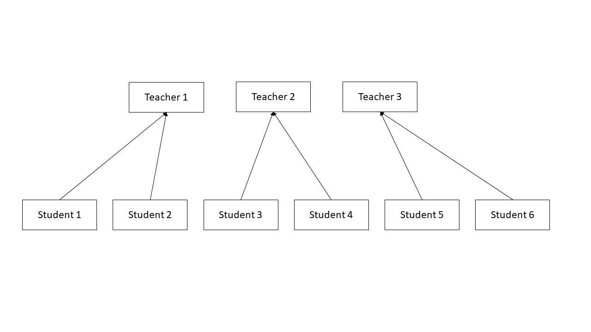
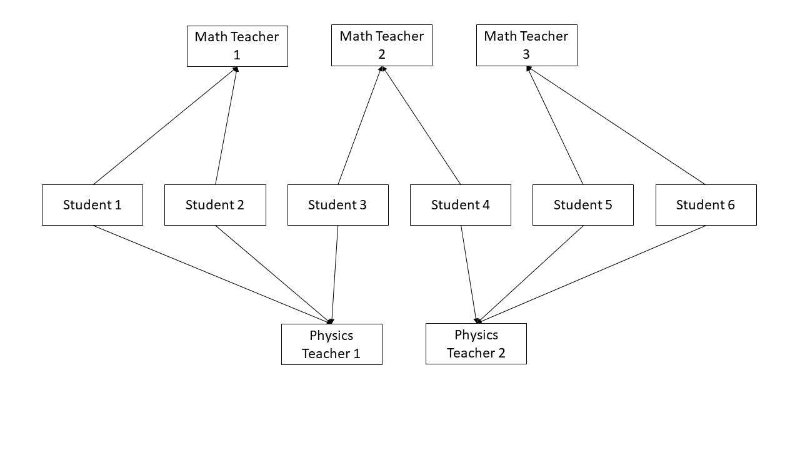
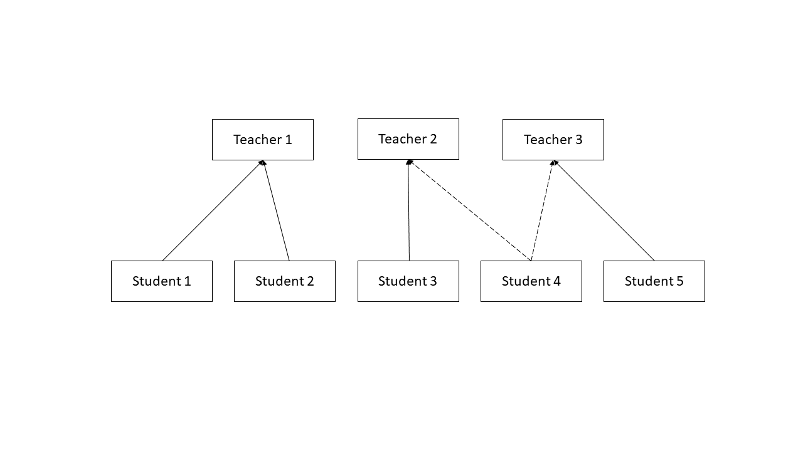

# Introduction 

When evaluating data in the educational field and in many other fields, researchers often run into the problem of their data being nested or clustered.  When this occurs, they are no longer able to use multiple regression, as they would be violating the independent observations assumption, and may instead turn to multilevel modeling.  With multilevel modeling, a researcher is able to handle students nested in schools and patients nested in nurses, as well as longitudinal models where time points are nested within individuals.  However, a key facet to all of these models is the strict hierarchical nature of the data: each level one unit (students, patients, or time points) is nested within one, and only one, level 2 unit (school, nurse, individual).  If we were to draw this relationship, it would look like Figure 1: there are no lines that are crossed, and each level one unit is associated with only one level two unit.  This can also be represented in table form; a true hierarchical model will only have one row.  

```{r fig 1, fig.cap = "Figure 1: A pure hierarchical model", echo = FALSE}

```

```{r true hierarchical dataframe, echo = FALSE, include = FALSE}
thdf <- data.frame(student = ('student'),
                   Math_Teacher_1 = ("1, 2"),
                   Math_Teacher_2 = ("3, 4"),
                   Math_Teacher_3 = ("5, 6"))
```

```{r true hierarchical table, echo = FALSE}
knitr::kable(thdf, booktabs = TRUE, caption = 'Data distribution indicating a true hierarchical model'

)
```

Two level strict hierarchical models can be written as two separate equations, each representing a level of the model.   
$$y_{ij} = \beta_{0j} + r_{ij}$$ 
$$\beta_{0j} = \gamma_{00} + u_{0j}$$, 

With these equations, $y_{ij}$ is outcome and $\beta_{0j}$ represents intercepts.  In the intercept-only model presented, there are no slope components, but if we were to add in predictors, we could examine how slopes vary.  $r_{ij}$ is the random variation in level one, while $u_{0j}$ is random variation in level 2 [@SnijdersICC].

## Non-hierarchical models in brief
While data can be purely hierarchical as described above, situations often arise when level 1 units do not fit neatly into one and only one level 2 cluster.  One example of this type of non-hierarchical model is a cross-classified model.  In this instance, level 1 units are members of more than one level two cluster, but there is not a pure hierarchy.  For example, students may be nested within both biology classes and chemistry classes, with the outcome measurement being science knowledge.  It would seem wise to take into account both the impact of biology classes as well as chemistry classes.  However, students who were in the same biology class are not all in the same chemistry class.  This situation would require the use of a cross-classified model.  Cross-classified models, like pure hierarchical models, can also be represented in table or visual form.  In table form, the cross classified structure becomes evident when there are level one units in more than one row and column.  In the simple example below, there are multiple cells filled in both rows (Physics Teacher 1 and 2) and in columns (Math Teacher 2) [@Beretvas].
```{r fig 2, fig.cap = "Figure 2: A Cross-classified model", echo = FALSE}

```

```{r cross classified table, echo = FALSE, include = FALSE}
cct <- data.frame(' ' = c("Math Teacher 1", "Math Teacher 2", "Math Teacher 3"),
                  "Physics Teacher 1" = c("1, 2", "3", " "),
                  "Physics Teacher 2" = c(" ", "4", "5, 6"))
```
```{r cc table, echo = FALSE, include = FALSE}

knitr::kable(cct, booktabs = TRUE, caption = 'Data distribution indicating a cross-classified model')
```

Another type of non-hierarchical model is a multiple membership model.  In this instance, there is only one level 2 cluster being considered, but the level 1 units do not all belong to one and only one cluster.  These types of models are frequently employed in education to model what are termed mobile students: students who attend more than one school over a given time frame.  An example of mobile students might be those who attend more than one elementary school prior to a state-wide 5th grade test.  Multiple membership data are also evident in table form, as well as in a unit diagram. As with the other diagrams, however, these can quickly become visually confusing with large data sets [@Leckie2013, @Beretvas]. 
```{r fig 3, fig.cap = "Figure 3: A Multiple Membership model", echo = FALSE}

```

```{r multiple membership table, echo = FALSE, include = FALSE}
mmt <- data.frame("Student ID" = c("1", "2", "3", "4", "5"),
                  "Math Teacher 1 ID" = c("X", "X", " ", " ", "X"),
                  "Math Teacher 2 ID" = c(" ", " ", "X", " ", "X"),
                  "Math Teacher 3 ID" = c(" ", " ", "X", "X", " "))
```
```{r mm table, echo = FALSE, include = FALSE}

knitr::kable(mmt, booktabs = TRUE, caption = 'Data distribution indicating a multiple membership model')
```

Moving forward, we will focus exclusively on multiple membership models, going more in-depth into their intricacies as well as walking through a tutorial running a model and interpreting the output.


